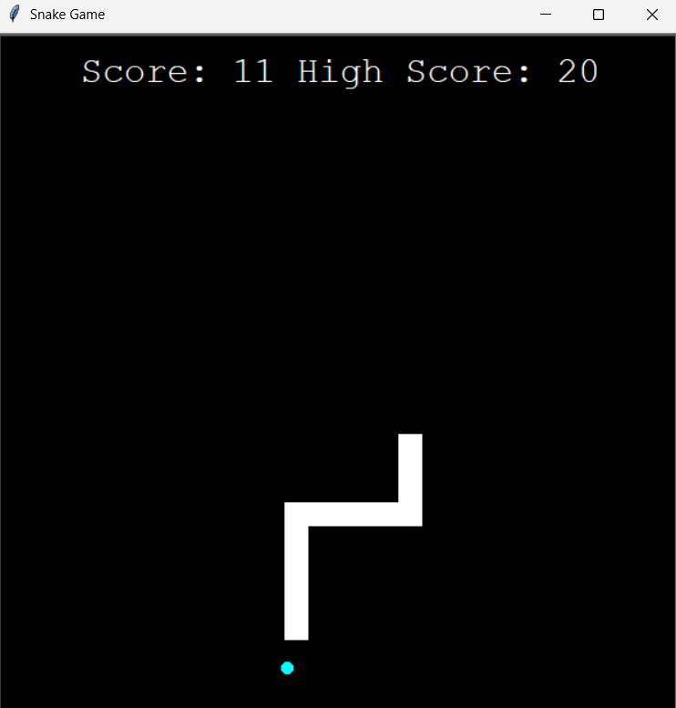

# Snake Game (Python)



Classic Snake game built with Python and the `turtle` module.

## Features
- Object-oriented structure (Snake, Food, Scoreboard)
- Score tracking
- Collision detection (walls and tail)

## How to run
1. Install Python 3
2. Run:
```bash
python main.py
```

## Controls

- Arrow keys: move the snake
